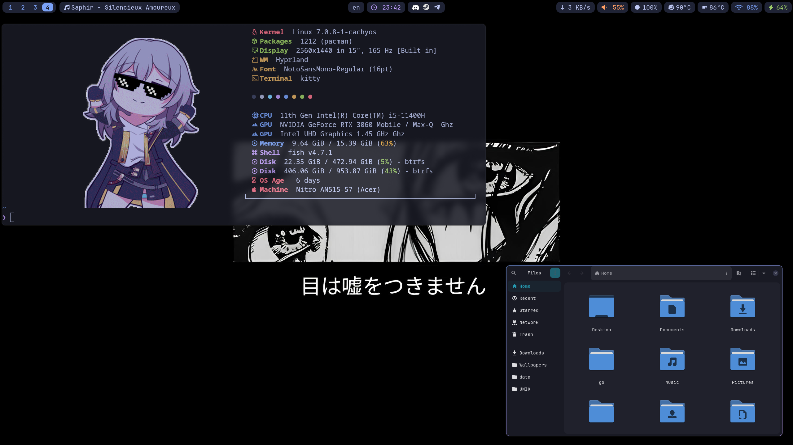
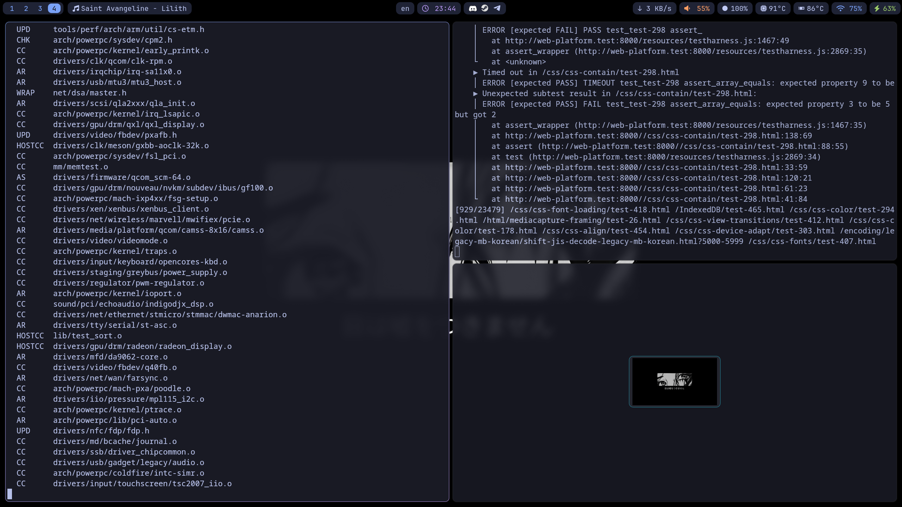
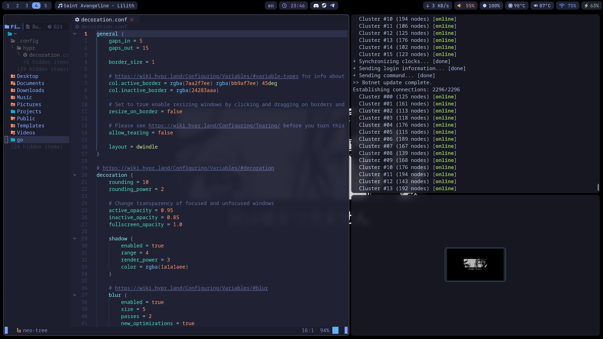

# sqlxoxo configuration files for Hyprland





## about my config
os: CachyOS
shell: fish
terminal: kitty
launcher: wofi
wallpaper changing: awww

## system
| Component | Details |
| :--- | :--- |
| OS | CachyOS |
| Window Manager | Hyprland |
| Terminal | kitty |
| Shell | fish |
| Display | 2560x1440, 165 Hz |
| Machine | Acer Nitro AN515-57 |

## how to get my config?
Basically just cloning this repo and replacing corresponding directories in `~/.config`.

1. Clone the repository.
```bash
git clone [https://github.com/sqlxoxo/Hyprland-config.git](https://github.com/sqlxoxo/Hyprland-config.git)
```
2. Move into the cloned repo and copy the files to your config directory.
```
cd Hyprland-config
cp -r * ~/.config/
```
